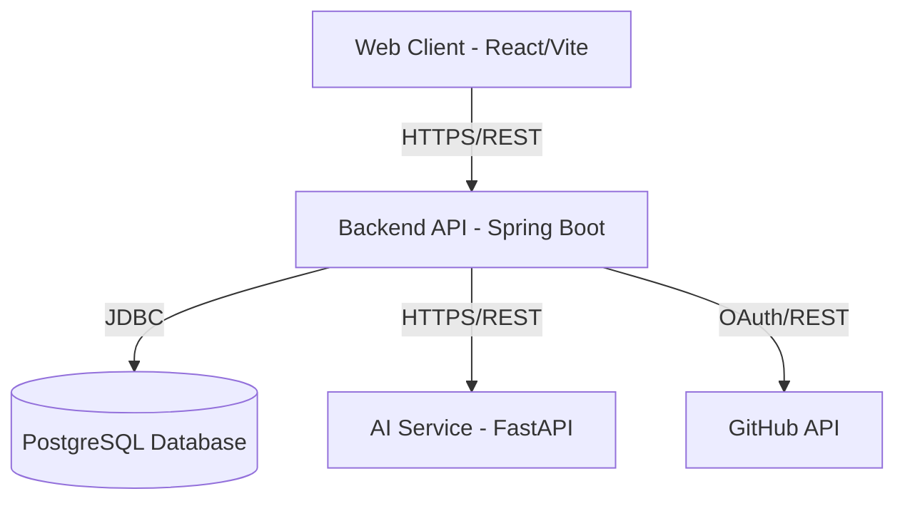
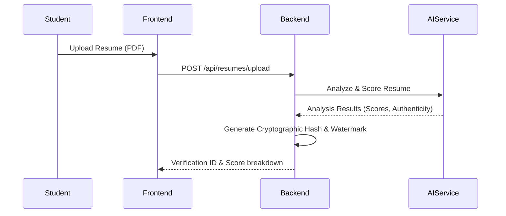
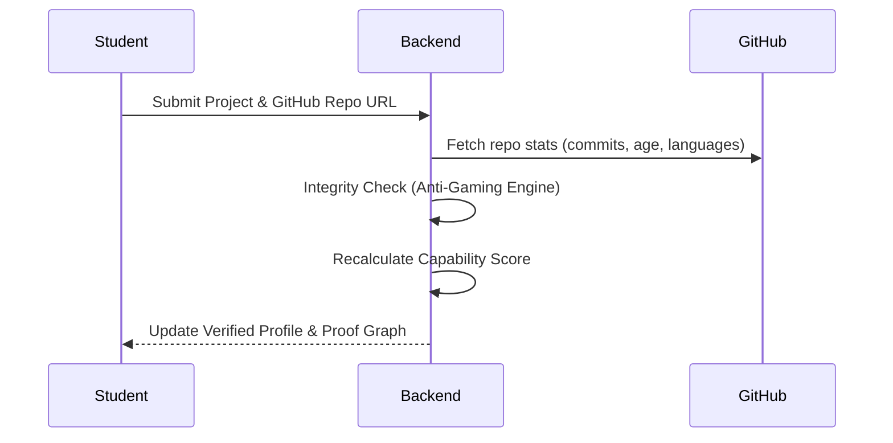

# ProofHire - Architecture Documentation

## Core Philosophy
"RESUMES TELL YOU WHAT SOMEONE CLAIMS. PROOF OF WORK SHOWS WHAT THEY CAN ACTUALLY DO."

ProofHire is a modern, evidence-based technical hiring platform designed to replace traditional resume-screening with verifiable proof of capability.

## High-Level Architecture

### Components

1. **Frontend (Web Client)**
   - **Tech Stack:** React, Vite, TypeScript, Tailwind CSS, Framer Motion
   - **Role:** Provides role-based UI (Student, Recruiter, Admin). 
   - **Key Features:** Capability Dashboard, Proof Graph, Project Uploads, Interview Interface.

2. **Backend (Spring Boot API)**
   - **Tech Stack:** Java, Spring Boot, Spring Security (JWT), Spring Data JPA
   - **Role:** Core business logic, RBAC authentication, CRUD operations, ranking engine.
   - **Key Features:** Verification Engine, Anti-Gaming logic, Dynamic Ranking, GitHub Integration.

3. **AI Service (FastAPI)**
   - **Tech Stack:** Python, FastAPI, OpenAI API (or compatible local LLM)
   - **Role:** Handles all AI-intensive workloads.
   - **Key Features:** Resume Analysis, AI-Style Detection, Virtual AI Interviewer, AI Career Coach.

4. **Database (PostgreSQL)**
   - **Role:** Relational data storage for Users, Profiles, Projects, Challenges, Scores, Jobs, and Logs.

## System Flows

### 1. Resume Verification Flow

### 2. Project Verification & Capability Scoring

## Security & Anti-Gaming

- **Resume Tamper Detection:** Cryptographic hashing of verified resumes.
- **Project Authenticity:** GitHub repository age, commit density checks.
- **AI-Slop Detector:** Heuristic and LLM-based generic text detection.
- **Authentication:** JWT with HttpOnly cookies or secure headers, BCrypt for passwords.
