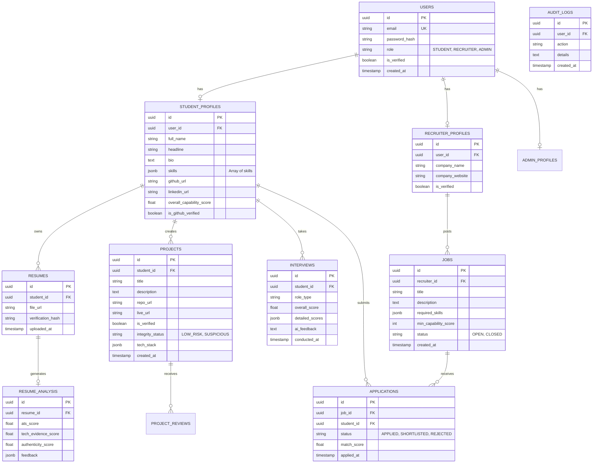

# ProofHire - Database Schema

```mermaid
erDiagram
    USERS ||--o| STUDENT_PROFILES : has
    USERS ||--o| RECRUITER_PROFILES : has
    USERS ||--o| ADMIN_PROFILES : has
    USERS {
        uuid id PK
        string email UK
        string password_hash
        string role "STUDENT, RECRUITER, ADMIN"
        boolean is_verified
        timestamp created_at
    }

    STUDENT_PROFILES ||--o{ RESUMES : owns
    STUDENT_PROFILES ||--o{ PROJECTS : creates
    STUDENT_PROFILES ||--o{ INTERVIEWS : takes
    STUDENT_PROFILES ||--o{ APPLICATIONS : submits
    STUDENT_PROFILES {
        uuid id PK
        uuid user_id FK
        string full_name
        string headline
        text bio
        jsonb skills "Array of skills"
        string github_url
        string linkedin_url
        float overall_capability_score
        boolean is_github_verified
    }

    RESUMES ||--o| RESUME_ANALYSIS : generates
    RESUMES {
        uuid id PK
        uuid student_id FK
        string file_url
        string verification_hash
        timestamp uploaded_at
    }

    RESUME_ANALYSIS {
        uuid id PK
        uuid resume_id FK
        float ats_score
        float tech_evidence_score
        float authenticity_score
        jsonb feedback
    }

    PROJECTS ||--o{ PROJECT_REVIEWS : receives
    PROJECTS {
        uuid id PK
        uuid student_id FK
        string title
        text description
        string repo_url
        string live_url
        boolean is_verified
        string integrity_status "LOW_RISK, SUSPICIOUS"
        jsonb tech_stack
        timestamp created_at
    }

    RECRUITER_PROFILES ||--o{ JOBS : posts
    RECRUITER_PROFILES {
        uuid id PK
        uuid user_id FK
        string company_name
        string company_website
        boolean is_verified
    }

    JOBS ||--o{ APPLICATIONS : receives
    JOBS {
        uuid id PK
        uuid recruiter_id FK
        string title
        text description
        jsonb required_skills
        int min_capability_score
        string status "OPEN, CLOSED"
        timestamp created_at
    }

    APPLICATIONS {
        uuid id PK
        uuid job_id FK
        uuid student_id FK
        string status "APPLIED, SHORTLISTED, REJECTED"
        float match_score
        timestamp applied_at
    }

    INTERVIEWS {
        uuid id PK
        uuid student_id FK
        string role_type
        float overall_score
        jsonb detailed_scores
        text ai_feedback
        timestamp conducted_at
    }

    AUDIT_LOGS {
        uuid id PK
        uuid user_id FK
        string action
        text details
        timestamp created_at
    }
```
